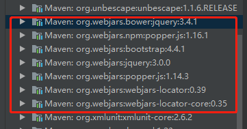

spring 引入通过maven引入bootstrap在页面上引入技巧

### 一、pom.xml引入的项目

```xml
<!-- bootstrap的css -->
<dependency>
    <groupId>org.webjars</groupId>
    <artifactId>bootstrap</artifactId>
    <version>4.4.1</version>
</dependency>
<!-- jquery.js -->
<dependency>
    <groupId>org.webjars.bower</groupId>
    <artifactId>jquery</artifactId>
    <version>3.4.1</version>
</dependency>
<!-- 使用是在html中还再需要填写版本号，会自动添加 -->
<dependency>
    <groupId>org.webjars</groupId>
    <artifactId>webjars-locator</artifactId>
    <version>0.39</version>
</dependency>
<!-- popper.js文件 -->
<dependency>
    <groupId>org.webjars.npm</groupId>
    <artifactId>popper.js</artifactId>
    <version>1.16.1</version>
</dependency>
```

### 二、页面引入thymeleaf

```html
<html lang="en" xmlns:th="http://www.thymeleaf.org">
```

### 三、html中引入的link 和script

```html
    <link th:href="@{/webjars/bootstrap/css/bootstrap.css}" rel="stylesheet" >
<!--    <script th:src="@{/webjars/jquery/3.4.1/dist/jquery.slim.js}"></script>-->
    <script th:src="@{/webjars/jquery/dist/jquery.slim.js}"></script>
    <script th:src="@{/webjars/bootstrap/js/bootstrap.min.js}"></script>
    <script th:src="@{/webjars/popper.js/dist/popper.js}"></script>
```

### 四、maven引用显示

